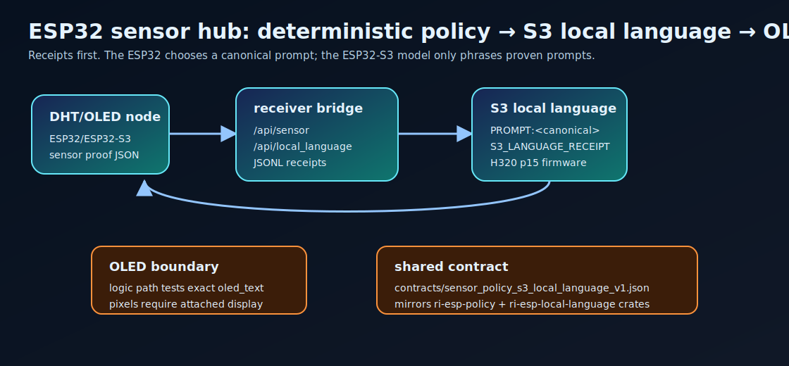

# ESP32 Sensor Hub



ESP32/ESP32-S3 room sensor firmware plus a local receiver bridge. It reads DHT temperature/humidity, displays status on SSD1306 OLED, emits receipt-backed sensor JSON, and routes deterministic sensor policy prompts into an ESP32-S3 local-language model.

This is local-first physical AI plumbing, not a cloud demo.

## What it gives you

- ESP32/ESP32-S3 firmware for DHT + OLED + WiFi.
- HTTP sensor posting to a local receiver.
- Local ESP32 endpoints for `/status`, `/sensors`, `/ai`, and `/ai/stream`.
- Optional GTX/Ollama endpoint path for larger model responses.
- Deterministic sensor-policy to ESP32-S3 local-language bridge.
- Machine-readable receipts for sensor readings and local-language outputs.
- Shared contract file to reduce drift between Rust crates, Python receiver, and firmware constants.

## Data flow

1. Sensor node reads DHT temperature/humidity.
2. Firmware builds `ri_esp_proof_receipt_v1` evidence.
3. Deterministic policy maps the reading to one canonical prompt.
4. Receiver sends `PROMPT:<canonical prompt>` to the ESP32-S3 language board when configured.
5. ESP32-S3 returns `S3_LANGUAGE_RECEIPT` with short OLED-ready text.
6. Receiver writes JSONL receipts and returns `oled_text`.
7. Sensor node displays returned text on OLED when hardware is attached.

## Claim boundary

Proven by receipts:

- firmware builds for `esp32dev` and `esp32s3`
- receiver policy cases pass
- HTTP `/api/local_language` returns expected `oled_text`
- real ESP32-S3 local-language prompt receipts were previously tested on `/dev/ttyACM0`
- cold/dry unsupported conditions map to safe no-claim language
- stale readings map to stale-data language

Not claimed without attached hardware:

- SSD1306 pixels physically render
- I2C address/wiring are correct on an arbitrary board
- GTX/Ollama endpoint is installed on every target machine

## Hardware profile

Default PlatformIO env: `esp32dev`

- DHT sensor on GPIO4; `include/config.h.example` currently uses DHT11, change `DHT_TYPE` to DHT22 for AM2302/DHT22 hardware
- SSD1306 OLED, 128x64, I2C address `0x3C`
- ESP32 default I2C: SDA GPIO21, SCL GPIO22
- ESP32-S3 warning: do not use GPIO8/9 for I2C on N16R8/PSRAM boards; use safe exposed pins such as GPIO21/GPIO47 when available

If using DHT11, change `DHT_TYPE` in `include/config.h`.
If using 128x32 OLED, change `OLED_HEIGHT`.

## Repository layout

- `src/main.cpp` — sensor firmware, proof receipts, OLED, AI/local-language calls
- `include/config.h.example` — copy to `include/config.h` and set WiFi/server values
- `include/sensor_policy_contract.h` — generated firmware constants from the shared contract
- `contracts/sensor_policy_s3_local_language_v1.json` — canonical policy/prompt/output contract
- `tools/sensor_receiver.py` — local HTTP receiver and S3 serial bridge
- `tools/test_sensor_policy_s3_language.py` — hard no-OLED policy/S3/HTTP verification harness
- `tools/ai_infer_gemma_ollama.py` — Ollama-backed local GPU endpoint
- `tools/ai_infer_stub.py` — fake endpoint for plumbing tests
- `docs/wiring.md` — wiring notes
- `docs/architecture.md` — expansion plan

## Setup

```bash
cd /home/sikmindz/projects/esp32-sensor-hub
cp include/config.h.example include/config.h
# edit include/config.h: WiFi password, receiver IP, AI endpoint IPs
```

Install PlatformIO if needed:

```bash
python3 -m venv .venv
. .venv/bin/activate
pip install platformio
```

Build both supported firmware targets:

```bash
/home/sikmindz/.local/bin/pio run -e esp32dev
/home/sikmindz/.local/bin/pio run -e esp32s3
```

Flash:

```bash
/home/sikmindz/.local/bin/pio run -e esp32dev -t upload --upload-port /dev/ttyUSB0
# or, for S3 sensor-hub firmware:
/home/sikmindz/.local/bin/pio run -e esp32s3 -t upload --upload-port /dev/ttyACM0
```

Monitor:

```bash
/home/sikmindz/.local/bin/pio device monitor -b 115200
```

## Run the local receiver

Static fallback mode, no S3 hardware required:

```bash
python3 tools/sensor_receiver.py --host 0.0.0.0 --port 8088
```

Real ESP32-S3 local-language bridge:

```bash
python3 tools/sensor_receiver.py --host 0.0.0.0 --port 8088 --s3-port /dev/ttyACM0 --s3-timeout-s 25
```

Health check:

```bash
curl http://127.0.0.1:8088/health
```

Sensor post smoke test:

```bash
curl -X POST http://127.0.0.1:8088/api/sensor \
  -H 'Content-Type: application/json' \
  -d '{"device_id":"test","status":"ok","temperature_c":22.1,"temperature_f":71.8,"humidity_pct":44.2,"sensors":{"dht":{"valid":true,"last_read_ms":1}}}'
```

Local-language smoke test:

```bash
curl -X POST http://127.0.0.1:8088/api/local_language \
  -H 'Content-Type: application/json' \
  -d '{"device_id":"test","uptime_ms":1000,"status":"ok","temperature_f":87.8,"humidity_pct":72,"sensors":{"dht":{"valid":true,"last_read_ms":900}}}'
```

Expected `oled_text`:

```json
"escalate."
```

## ESP32 local endpoints

Once booted, the serial monitor prints the ESP32 IP address.

- `GET /status` — current device/sensor/network status
- `GET /sensors` — latest sensor payload JSON
- `POST /ai` — forwards sensor context plus request JSON to `AI_INFER_URL`, waits for final JSON, and shows the response on OLED
- `POST /ai/stream` — forwards sensor context to `AI_STREAM_URL` and streams text back onto the OLED while Gemma generates it

Examples:

```bash
curl http://ESP32_IP/status
curl http://ESP32_IP/sensors
curl -X POST http://ESP32_IP/ai -H 'Content-Type: application/json' -d '{"prompt":"what does this room condition imply?"}'
curl -X POST http://ESP32_IP/ai/stream -H 'Content-Type: application/json' -d '{"prompt":"give a short OLED-ready room status"}'
```

## Shared contract

Canonical policy lives in:

```text
contracts/sensor_policy_s3_local_language_v1.json
include/sensor_policy_contract.h
```

The JSON contract mirrors the published Rust crates:

```toml
ri-esp-policy = "0.1.1"
ri-esp-local-language = "0.1.1"
ri-esp-proof = "0.1.1"
```

Policy thresholds:

- stale after `120000 ms`
- hot `>= 82F`
- cold unsupported `<= 60F`
- humid `>= 65%`
- dry unsupported `<= 25%`

Canonical prompt/output examples:

- hot + humid -> `high heat and humidity. action is ` -> `escalate.`
- stale -> `stale data. action is ` -> `wait for fresh data.`
- cold/dry unsupported -> `safe action is ` -> `no claim without evidence.`
- normal -> `normal room. action is ` -> `log receipt.`

## Verification

No-OLED hard test:

```bash
python3 tools/test_sensor_policy_s3_language.py --rounds 1 --timeout-s 5
```

Real S3 hard test:

```bash
python3 tools/test_sensor_policy_s3_language.py --s3-port /dev/ttyACM0 --rounds 3 --timeout-s 25 --http-real-s3
```

Firmware build gates:

```bash
/home/sikmindz/.local/bin/pio run -e esp32dev
/home/sikmindz/.local/bin/pio run -e esp32s3
```

Latest no-OLED receipt target:

```text
sensor_policy_s3_hard_test_receipt.json
```

## Gemma/Ollama endpoint

Default target model: `gemma4:12b` via Ollama on the GTX 1070 machine.

Run:

```bash
OLLAMA_MODEL=gemma4:12b tools/run_gemma_ai.sh
```

Health check:

```bash
curl http://127.0.0.1:8090/health
```

Boundary: this repo includes endpoint plumbing. It does not prove GPU acceleration unless the target machine has working NVIDIA drivers and the model is installed.

## Receipts written by the receiver

- `sensor_readings.jsonl`
- `esp32_receipts.jsonl`
- `esp32_s3_local_language_receipts.jsonl`
- `sensor_policy_s3_language_receipts.jsonl`
- `sensor_policy_s3_hard_test_receipt.json`

These files are generated runtime evidence and are ignored by git.

## License

MIT OR Apache-2.0 unless a file says otherwise.
